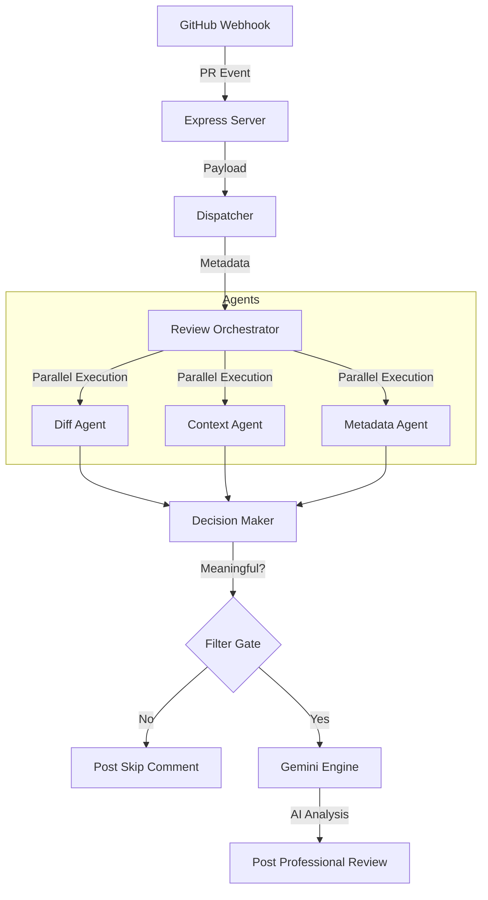

# System Architecture

The AI Code Review Agent follows a **Modular Agentic Workflow**. Instead of sending a raw diff directly to an LLM, the system decomposes the review process into specialized stages.

## 🏗️ High-Level Component Diagram

## 🔄 Core Workflow

### 1. Ingestion Layer (`src/api/server.ts` & `src/events/dispatcher.ts`)
- Listens for `pull_request` events (`opened`, `synchronize`).
- Validates the payload and extracts core identifiers like PR Number, Repository Name, and commit SHAs.

### 2. Orchestration Layer (`src/orchestrator/ReviewOrchestrator.ts`)
- Manages the lifecycle of a single review.
- Uses `Promise.all` to run specialized agents concurrently to minimize latency.

### 3. Intelligence Layer (`src/engine/GeminiEngine.ts`)
- Uses the aggregated data from all agents to build a high-context prompt.
- Executes the `gemini-2.5-flash` model to generate the final code review.

### 4. Output Layer (`src/api/github.ts`)
- Communicates back to GitHub via the REST API to post comments.
